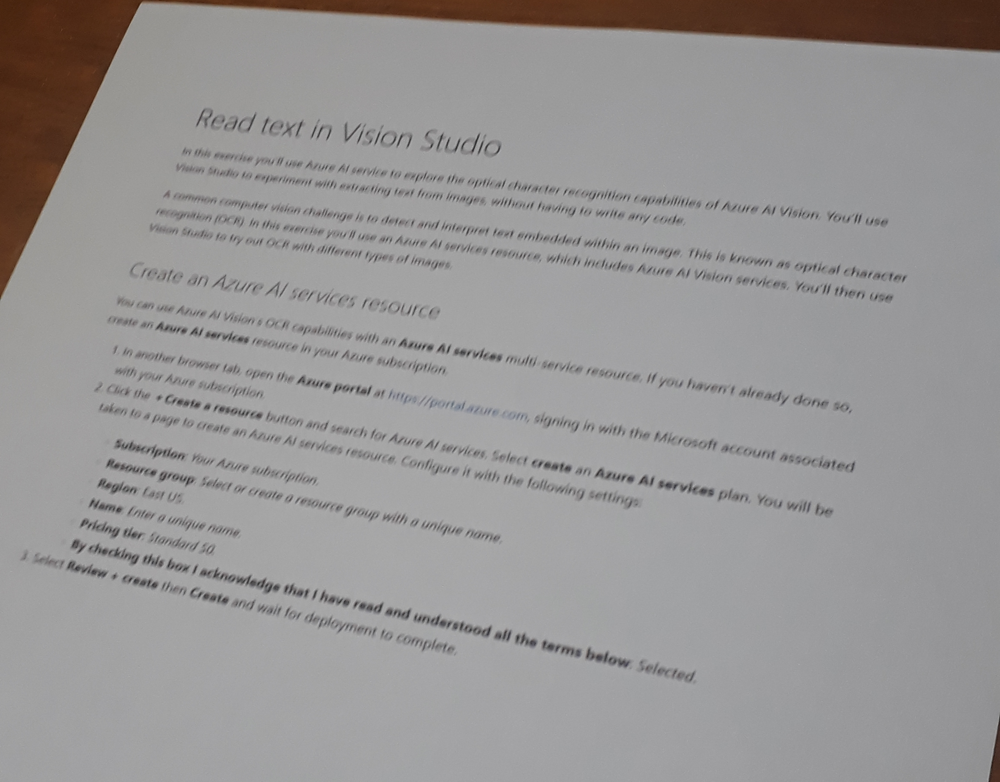
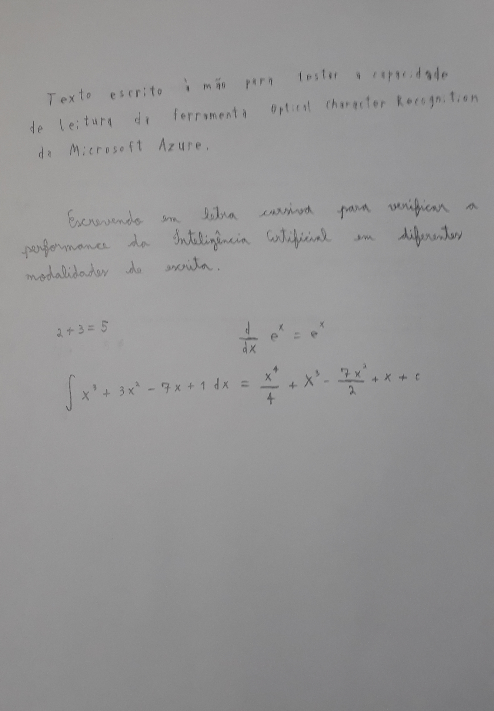

# Uso do Serviço *Optical Character Recognition* (OCR) do Microsoft Azure

Este projeto relata uma utilização do serviço OCR do Microsoft Azure, a fim de testar e se familiarizar com a ferramenta de Inteligência Artificial (IA).

Utilizando duas imagens com texto, uma com texto impresso e outra com texto escrito à mão, o serviço OCR será utilizado para processar as imagens, e observar o resultado fornecido pela IA.
Com isso, será possível ter uma noção das capacidades e dos limites do OCR.

Para utilizar o OCR da Azure, basta seguir o [tutorial](https://microsoftlearning.github.io/mslearn-ai-fundamentals/Instructions/Labs/05-ocr.html) disponibilizado pela prória Microsoft.

As imagens utilizadas como entradas neste projeto estão localizadas no diretório `inputs`, enquanto as respostas da IA estão no diretório `output`.

## Texto Impresso

Para o primeiro teste, um trecho do tutorial mencionado acima foi impresso, e a foto foi tirada com um certo ângulo, e trechos mais distantes da câmera estão mais borradas, porém ainda legíveis.
Essas dificuldades adicionadas propositalmente visam verificar como a IA performa com esses problemas, que são bem recorrentes em cenários reais.

Observando a saída, é possível observar que quase todo o texto foi lido corretamente, com os erros listados a seguir:
- Vários erros na detecção de pontuação, como trocar os caracteres `,`, `.` e `:`, ou até não detectar algumas pontuações.
- Ler `Al` (com um `L` minúsculo) em vez de `AI`, múltiplas vezes.
- Trocar um `z` por `s` em "`Asure`" quando deveria ser `Azure`, na linha 9.
- Trocar um `E` por `L` em "`Last`" quando deveria ser `East`, na linha 16.
- Trocar um `S` por `5` em "`50`" quando deveria ser `S0`, na linha 1.

No geral, foram poucos erros cometidos, e, observando a imagem, os trechos com erros eram difíceis de ler pela foto e humanos poderiam cometer o mesmo erro. Além disso, os erros cometidos não comprometem o entendimento do texto.

## Texto Escrito à Mão

No segundo teste, um texto foi escrito à mão, para ter uma noção de como o OCR consegue ler a escrita manual, que consegue ser muito diferente de algo impresso, sendo um desafio muito maior para a IA.

Foram escritos três trechos para testar a IA, como pode ser visto na imagem:

Nos dois primeiros trechos, que continham apenas texto simples, o OCR conseguiu ler tudo muito bem, com apenas dois pequenos erros:
- Utilizar um `c` minúsculo em vez de `C` maiúsculo, em "`Character`", na linha 2.
- Utilizar uma vírgula em vez de um ponto, na linha 3.

Contudo, no terceiro trecho, que continha algumas equações matemáticas, a IA falhou completamente. Apesar de entender `2 + 3 = 5`, a tecnologia OCR mostrou que não foi treinada para identificar símbolos e notações matemáticas um como frações, exponenciações, derivadas e integrais.

Essa falha apenas indica que a OCR não foi feita para esse uso, e, se o usuário precisar de uma IA para ler equações matemáticas, uma outra ferramenta será necessária.

## Conclusão

A tecnologia OCR da Microsoft Azure se mostrou bem competente para ler textos impressos e escritos à mão, apesar de não ser perfeita. É também necessário ter em mente que o escopo da atuação dessa ferramenta não é ampla, se limitando apenas a textos simples (pelo menos de acordo com os testes aqui realizados).
